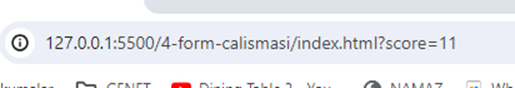
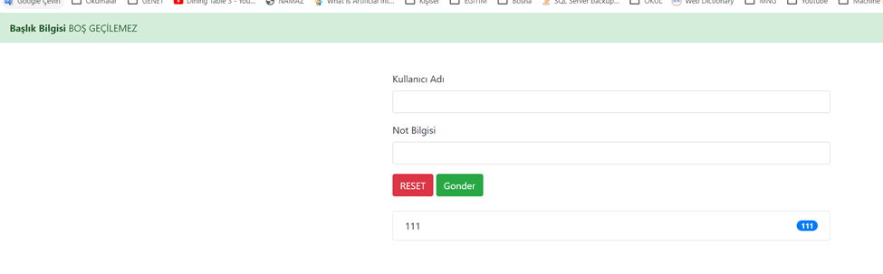

# Javascript

### Hello World

**Chrome console da çıktıları görmek için**
Chrome da inspector -> Console kısmı açılır.

```javascript

 code console.log("Hello World")
```

komutu ile doğrudan console'a yazdırır.

---

**Sayfada alarm üretmek**
``` javascript
alert("Hello World")
```
---

## DEĞİŞKENLER

JavaScript dili weakly-typed yani güçsüz türlü bir dildir. Değişkenlerin ve parametrelerin türlerini bildirmek gerekmez.

- CaseSensitive’dir
- Değişkenlerde Camel CASE
- Sabitlerde UPPER_CASE kullanılır

``` javascript 

// CAMEL CASE KULLANIMI 

let fullName=""
let kodluyoruzServerInfo=""

// UPPER CASE KULLANIMI
// constlarda büyük harf kullanılır. 
const PASSWORD =1234
const SERVER_PASSWORD = 1234
console.log(PASSWORD)

// Boolen tanımlarke is/has kullanımı 
let isActive= true // Aktif mi
let hasPassword = true // Password var mı?

let firstName = "Bayram", lastName = "Demirci" // Bunun yerine
// Bu şekilde kullanılması tavsiye edilir. 
let firstName = "Bayram"
let lastName = "Demirci"
console.log(firstName,lastName)


```
JavaScript loosely typed bir programlama dilidir. Yani bir değişkeni tanımlarken değişkenin türünü (sayısal, metinsel, boolean) belirtmemize gerek yoktur.

#### Değişken Tanımlama Kuralları

- Değişken isimleri Türkçe karakter içermemelidir.
- Değişken isimleri büyük ve küçük harf duyarlıdır.
- Değişken isimlerinde ilk karakter bir sayı olamaz.
- Değişken isimlerinde JavaScript etiketleri kullanılamaz.
- Değişken isimlerinde sayı, harf, alt çizgi ve dolar işareti kullanılabilir; boşluk, noktalama işareti veya sembol kullanılamaz.


#### Değişken Türleri

**Boolean** = Mantıksal ifadedir. true veya false **değeri** atanabilir
**Number** = Sayısal ifadedir. 2^53 -1 değerine kadar sayısal değerler atanabilir.
**BigInt** = 2^53-1 değerinden büyük değerleri atayabilir.
**String** = Metinsel ifadelerdir. Metinsel ifade tanımlanırken ifade “ ” veya ‘ ’ işaretleri arasına yazılır.
**Object** = Yukarıda ki 7 veri türü de primitive tiplidir. Objelerde ( nesne, dizi ) gibi referans tipler de değişkenlere atanabilir.

>Değişken tanımlarken kodunuzun daha okunabilir olması için, camelCase isimlendirme kuralını kullanmalısınız. 


#### var
Global scope veya function scope'ta deklarasyon sağlayamaya yarayan keyword'dur. Scope özelliklerini daha sonra örneklerle açıklayacağız. var ile tanımlanan değişkenlerin özellikleri şunlardır.

Değişken değerleri değiştirilebilir.
Aynı isimle tekrardan tanımlanabilirler.

var ile tanımlanan değişkenler global scope veya function scope'tur. Global scope'ta tanımlanan değişkenlere her yerden ulaşılabilir. Function içerisinde tanımlanan değişkenlere ise tanımlı olduğu fonksiyonda ulaşılabilir. Bu konuyu örneklerle açıklayalım.

#### let

Değişkenleri block scope'ta tanımlayan deklarasyondur. let ile tanımlanan değişkenlerin özellikleri şunlardır.

Değişken değerleri değiştirilebilir.
Aynı isimle tekrardan aynı blokta tanımlanamaz. Farklı block'larda aynı isimle tanımlanabilir.

```javascript 

//var pek kullanılmıyor. Genelde
//let ve conts kullanılıyor. 

var serverName="kodluyoruz.org"
console.log(serverName)

// let ile değişkeni boş tanımlama
let serverName;
console.log(serverName)

// let ile değişkene bilgi atama
serverName = "http://genet.com.tr"
console.log(serverName)

// let ile değişkene bili atayarak tanımalamak 
let password = 1234;
console.log(password)

// let kullanıldığında değişken tanımlanmadan çağrıldığından hata fırlatır. 
console.log(fullName)
let fullName="Bayram"

// var kullanıldığında değişken tanımlanmadan çağrılırsa hata fırlatmaz. 
console.log(fullName)
let fullName="Bayram"

// değişkenin içeriğindeki bilgiye yeni bilgi ekleme
fullName += " Yeni bilgi"
 

```
---
### SABİTLER 
Block scope da tanımlı, değeri sonradan değiştirilemez değişkenleri deklare etmek için kullanılan keyword'dür.
Const ile tanımlanan objelerin özellikleri (properties) değiştirilebilir fakat objenin kendisi değiştirilemez. 
Diziler içinde aynısı geçerlidir. Dizi değerleri değiştirilebilir fakat dizinin kendisi değiştirilemez.

```javascript 
// const tnaımlanınca değer mutlaka tanımlanmalı 
const serverPassword; // HATA
const srvPass = 1234;

```

```javascript 
let price = 100 
let tax = 0.18 
let priceTax = price * tax
let total = price + priceTax
console.log(
    "Fiyat:",price,
    "KDV Oranı:", tax,
    "Toplam KDV:", priceTax,
    "Toplam Fiyat : ", total
    )

let counter = 320 
counter = counter + 1 // Uzun yöntem 
counter += 1
counter++
counter--
counter *=10 // Elindeki bilgiyi counter ile çarpma
console.log(counter)

// MOD ALMA KALAN 
// SAYI TEK Mİ ÇİFT Mİ? 
console.log(3%2) //Kalan 0 ise çifttir.     

// ÜS ALMA
console.log(2*2*2*2)
console.log(2**4)

// AŞAĞI YUVARLAMA 
console.log( "Aşağı yuvarlama : ", Math.floor(1.7) ) // MATH Kütüphanesi kullanılır. 1 'e yuvarlar. 
console.log( "Yukarı yuvarlama : ", Math.ceil(1.1))  // MATH Kütüphanesi kullanılır. 2 'ye yuvarlar.

// YAKINA YUVARLA 
console.log( "Yakına Yuvarla :", Math.round(1.2)) //1.2 > 1 'e yuvarlar 
console.log( "Yakına Yuvarla :", Math.round(2.5)) //2.5 > 3 'e yuvarlar 

// TÜR DÖNÜŞÜMÜ
let stringNumber = "11"
let newNumber = Number(stringNumber)

console.log(newNumber)
console.log(Number("123"))


let userName
let userName2 = "Bayram"
let isUserName = Boolean(userName)
console.log(isUserName)

Boolean("11") // True
Boolean("0")  // True
Boolean("")   // False
Boolean(0)    // False
Boolean(0.1)  // True

console.log(Boolean( userName2.Length > 0 ))


let price = 1 // NUMBER
console.log(
    "price:",
    typeof(price)
)

let price2 = 1.1 // NUMBER
console.log(
    "price:",
    typeof(price2)
)

let stringPrice = "1.1" // STRING
console.log(
    "string price:",
    typeof(stringPrice)
)

let hasPassword = true // BOOLEAN
console.log(
    "Has password price:",
    typeof(hasPassword)
)

// TÜR DÖNÜŞÜMÜ 
let number1 = "11"
number1 = parseInt(number1)
console.log("number1:", number1, typeof(number1))

let number2 = "1122px11" 
number2 = parseInt(number2) // Harften önceki sayıları alır. 
console.log("number2:", number2, typeof(number2))
console.log(number2)

let number3 = "1122px11" 
number2 = Number(number3) // Number yalnızca sayı ile alır. İçinde karakter olmamalı.
console.log("number3:", number3, typeof(number2))
console.log(number2)

let number4 = "11.1px" 
number4 = parseFloat(number4) // Harften önceki sayıları alır. 
console.log("number4:", number4, typeof(number4))
console.log(number4)

let number5 = "11.1px" 
number4 = Number(number4) // Number içinde harf varsa dönüştüremez. 
console.log("number5:", number5, typeof(number5))
console.log(number5)

let number6 = 55
number5 = number5.toString()
console.log(typeof(number5)) // STRING


```

---

###TEMPLATE LİTERAL

```javascript 

// STRING BİRLEŞTİRME

let username = "Hakan"
let DOMAIN = "kodluyoruz.org"

let email = username + "@" + DOMAIN
console.log("Merhaba", username, "sitemize hoşgeldin", "mail adresin:", email)

// TEMPLATE LITERALS
//Backtick işareti kulanılmalı 
let info = `
    Merhaba ${username} sitemize hoşgeldin... 
    Kısa isminiz : ${username[0]}
    Mail adresi : ${DOMAIN}****
    Borcun : ${2*300}
    `
console.log(info)

const kisi = "<p>"+ad+"</p>"+
              "<p>"+soyad+"</p>"+
              "<p>"+gozRengi+"</p>"+
              "<p>"+yas+"</p>"


let email ="bayram@genet.com.tr"
let firstName = "Bayram"
let lastName = "Demirci"

// length 
console.log(email.length)

//ilk Karakteri Bulmak -> [0]
console.log(firstName[0])
console.log(firstName.charAt[0])

// toUpperCase 
firstName = firstName.toUpperCase()

// toLowerCase
lastName = lastName.toLowerCase()

//indexOf
console.log("INDEX KULLANIMI: ", email.slice(email.indexOf("@")+1,email.indexOf("."))) // genet döndürür. 

// search 
// String içinde istediğimiz bilgiyi aramak ve yerini bulmak için "search" kullanılır.
// olmayan bir şey aratılır ise -1 döndürür 

let indexNo = email.search("@")
console.log(email[15])  
console.log(email.search("olmayanIcerik")) 

// slice
// metin içinde belirtilen aralığı keser
console.log(email.slice(4)) // 5. karakter dahil sonuna kadar getirir. 
console.log(email.slice(2,10)) // 3. den başla 10. karakter dahil al
console.log(email.slice(email.search("@")+1)) //genet.com.tr döndürür.

// replace
// metni yeni metin ya da karakter ile değiştirir. 
console.log(email.replace("genet","optera"))

// includes
// Karakter var mı yok mu ?  True False döner
console.log(email.includes("@")) // True döner.

//startsWith 
console.log(email.startsWith("ba")) // True

//endsWith 
console.log(email.endsWith(".com.tr"))

let email ="bayram@genet.com.tr"
let firstName = "Bayram"
let lastName = "Demirci"

// length 
console.log(email.length)

//ilk Karakteri Bulmak -> [0]
console.log(firstName[0])
console.log(firstName.charAt[0])

// toUpperCase 
firstName = firstName.toUpperCase()

// toLowerCase
lastName = lastName.toLowerCase()

//indexOf
console.log("INDEX KULLANIMI: ", email.slice(email.indexOf("@")+1,email.indexOf("."))) // genet döndürür. 

//lastIndexOf
// indexOf ile arasındaki tek fark aranan kelime birden fazla geçiyor ise en son eşleşmeden gelen index numarasını döndürür.

//Concat 
console.log("Concat Kullanımı: ",firstName.concat(lastName))

//chatAt
//Belirtilen index numarasında yer alan karakteri verir.

console.log(email.charAt("@"))

//Split 
//Split metodu ile istenilen metin diziye çevrilebilir. Kullanılan parametre ile metnin nasıl parçalanacağı belirtilir.

console.log("Split kullanımı:",email.split("@"))

// search 
// indexOf ile aynıdır
// String içinde istediğimiz bilgiyi aramak ve yerini bulmak için "search" kullanılır.
// olmayan bir şey aratılır ise -1 döndürür 

let indexNo = email.search("@")
console.log(email[15])  
console.log(email.search("olmayanIcerik")) 

// slice
// metin içinde belirtilen aralığı keser
console.log(email.slice(4)) // 5. karakter dahil sonuna kadar getirir. 
console.log(email.slice(2,10)) // 3. den başla 10. karakter dahil al
console.log(email.slice(email.search("@")+1)) //genet.com.tr döndürür.

// replace
// metni yeni metin ya da karakter ile değiştirir. 
console.log(email.replace("genet","optera"))

// includes
// Karakter var mı yok mu ?  True False döner
console.log(email.includes("@")) // True döner.

//startsWith 
console.log(email.startsWith("ba")) // True

//endsWith 
console.log(email.endsWith(".com.tr"))

```

### DOM ( DOCUMENT OBJECT MODEL )

```javascript 

//Sayfanın URL bilgisini almak
console.log(document.URL)

//Sayfa ile ilgili daha detaylı HTTP bilgisini almaka
console.log(document.location)

//Sayfanın hostnamesi
console.log(document.location.hostname)

//Sayfanın IP hariç URL path'ini almak
console.log(document.location.pathname)

//Sayfanın body 'sini almak
console.log(document.body)

//Sayfanın Head bölümünü almak
console.log(document.head)

//Sayfanın arka plan rengini kırmızı yapmak
document.body.style.backgroundColor = "red"


// Elemente göre erişim
let h2Title = document.getElementsByTagName("h2")
console.log(h2Title.title.innerHTML) // H2'ler arasında idsi title olanın metni 

// ID ye göre erişim
let h2 = document.getElementById("title")
console.log(h2.innerHTML)

// ID ye göre SET 
let baslik = document.getElementById("title")
console.log(baslik.innerHTML = "deneme") // id'si title olanın metnini deneme yapar.

//QuerySelector ile elemente erişme ( #list id ismidir)
let list = document.querySelector("ul#list>li>a")
console.log(list)

// ul>li>a içindeki metin
let listVerisi = document.querySelector("ul#list>li>a").innerHTML
console.log(listVerisi)

// id 's sayfalinki olan element
let link = document.querySelector("#sayfaLinki")
link.innerHTML = "test"
link.style.color = "red"

// Elemente class ekleme
link.classList.add("btn")

```

#### GetElementById
document objesinin getElementById() metodu ile sayfada bulunan html elementlerinin ID'leri referans alarak seçme işlemi yapabiliyoruz.

**HTML**
``` html
    <div id="unicorn">🦄</div>
```

**JS**
```javascript
const unicorn = document.getElementById('unicorn');
```

### Query Selector

QuerySelector ( ) yöntemi, CSS seçicilere dayalı olarak DOM'dan html elemanlarını seçmenize izin veren iki modern JavaScript yönteminden biridir. Bu yöntem ile hem css class'larını hem de id'lerini kullanabilirsiniz. Bunu yaparken class için ön ek olarak nokta ".", id'ler için kare "#" kullanmanız gerekir. Sayfada eşleşen ilk elemanı size döndürecektir. Belirtilen elemanın eşleşememesi durumunda geriye null dönecektir.

```javascript
const email = document.querySelector('#email);
```
#### PROMPT

Kullanıcıdan veri almak için kullanılıyor. Eski bir yöntem olduğundan pek kullanılmaz.

```javascript
let fullName = prompt("User Name:")
let fullNameElement = document.querySelector("#userName")

fullNameElement.innerHTML = `${fullNameElement.innerHTML} ${fullName}<small style="color:red">Hoşgeldin</small>`
console.log(fullNameElement)

```
---

### LİSTELERLER ÇALIŞMAK

```javascript
// Listenin ilk elemenı first-child 
let firstChild = document.querySelector("ul#list>li:first-child").innerHTML
let setFirstChild = document.querySelector("ul#list>li:first-child").innerHTML = "ANKARA"

// Listenin son elemanı last-child
let lastChild = document.querySelector("ul#list>li:last-child").innerHTML
console.log(lastChild)

// Listeye yeni veri ekleme

let getUlDOM= document.querySelector("ul#list")
let newItemDOM = document.createElement("li")
newItemDOM.innerHTML = "KENDİ DOMUM"
getUlDOM.append(newItemDOM) // Listenin sonuna ekler 
getUlDOM.prepend(newItemDOM)  // Listenin başına ekler
console.log(getUlDOM)

```

### Elemente Class Ekleme

```javascript
let h111 = document.querySelector("#hello")
console.log(h111)
h111.classList.add("text-primary")
// Birden fazla classı aynı anda ekleme
h111.classList.add("secondClass","thirdClass" )


```

### Elementten Class Silme

```javascript
// Elementten Class Silme
h111.classList.remove("secondClass")

```

---

### Operatörler

let price = 100
let type = "user"

##### EŞİT Mİ?

```javascript
console.log(price == 1)
console.log("Deneme")
```

#### HEM DEĞERİ HEM TÜRÜ EŞİT Mİ?

```javascript
console.log("Değeri ve Türü eşit mi ", price === 1)
```

#### VE &&
```javascript
console.log(price ==100 && type == "admin")
```

#### VEYA ||
```javascript
console.log(price || type == "user")
```

#### TERSİ !
```javascript
console.log(type === "user")


let userName = prompt("Kullanıcı adını girin:")

//Boolean("test")
//true
// Booleande içinde değer varsa true, yoksa false döner
// bundan dolaayı if(username) şeklinde kullanım doğrudur. 


if(userName)
{
    console.log(`Kullanıcı: ${userName}`)
    karsila(userName)
}
else if(!userName) // KULLANICI YOK
{
    console.log("Kullanıcı Yok")
}
else
{
    console.log(`Bilgi yok`)
}


function karsila(user)
{
let h1Label = document.querySelector("#info")
h1Label.innerHTML ="Merhaba", user
}


```

### SWITCH KULLANIMI 


```javascript
switch(userName)
{
    case "ali": 
        console.log("ali")
        break;
    case "veli":
        console.log("veli")
        break;
    default:
        console.log("isimsiz")
}


let info = document.querySelector("#info")

// userName boş değilse userName bilgisini yaz, boş ise kullanıcı yok yaz.
info.innerHTML = `${userName ? userName : "Kullanıcı Yok"}`

let productPrice = 100
let totalMoney = 99

let result = (totalMoney>productPrice) ? "You can buy":
             (totalMoney<productPrice) ? "YOU CAN'T BUY":
             "para miktarını girmen gerekir."


```

#### FONKSİYONLAR

```javascript
let firstName = "En üst"

//  Default parametre alır
function greatings(firstName=""){
    console.log(`İç ${firstName}`)
}

console.log(firstName)

let info = greatings()
console.log(info)


```

#### Anonim Fonksiyonlar
Anonim fonksiyonların (Anonymous Functions) bir adı yoktur ve bir değişkene atanarak yeri geldiğinde kullanılırlar.

```javascript

let add = function(sayi1, sayi2)
{
    console.log(sayi1+sayi2);
}

```
#### Değer Döndüren Fonksiyonlar

```javascript

function addition(sayi1,sayi2){
    return (sayi1+sayi2);
}

```

### Belirli Süre sonrasında fonksiyon çalıştırma

1 ve 2 değeri girilen addition metodunu 5 sn sonra çalıştırır. 

```javascript

setTimeout(() => {
    addition(1, 2)
}, 5000);

```

#### Arrow Functions

```javascript

let func = (param1, param2, param3) => expression;

```

Sayi1 ve sayi2 olarak 2 adet parametre alan bir fonksiyon ve sayi1*sayi2 çarpımını return eder. 

```javascript
const carpim = (sayi1, sayi2) => sayi1 * sayi2;
/* // Daha uzun hali ise; const carpim = function(sayi1,sayi2){ return sayi1 * sayi2; } */

console.log(carpim(3, 5));

```
Eğer ki geri dönen bir değer yok ise 

```javascript
const sonuc2= () => console.log("Girdisiz fonksiyon")
```

#### Dinamik fonksiyon oluşturma


```javascript
// Bir koşula göre 2 farklı fonksiyon çalıştırma
const developer = 
experience < 5 ? () => alert("bir çok konuyu biliyorum") : () => alert("hiçbirşey bilmyiroum")

```


### HTML içindeki elementi yakalama

Id ‘si baslik olan elementin textini değiştirir. 

```javascript
function yaz(hangiDom, message)
{
    let dom = document.querySelector(`#${hangiDom}`)
    dom.innerHTML = message
}

yaz("baslik","mesajınız222")

let stil = '<span style="color:red">Color Red </span>'
yaz("baslik",stil)


function hello(firstName)
{
    console.log("Merhaba " + `${firstName}`)
}

hello("javascript")


// => dan sonra birden fazla satırlı  işlem varsa süslü parantez kullanılır. 
const helloFunc = (firstName) => { console.log("Merhaba", `${firstName}`)}

helloFunc("Javasciptttt")


// Eğer bir parametre girişi varsa ve => bundan sonra olan kısım return kısmı tek bir işlem içeriyor ise
// aşağıdaki gibi kullanılabilir.

const helloFuncV2 = firstName => console.log("Merhaba", `${firstName}`)
helloFuncV2("Bayram")

// Parametre birden fazla ise parantez içinde kullanılır. 

const helloFuncV3 = (firstName, lastName) => console.log("Merhaba", `${firstName} ${lastName}`)
helloFuncV3("bayram", “demirci")


```

### Event Listener 

```javascript
let h1DOM = document.querySelector("#baslik")
h1DOM.innerHTML = "Selamlar"
h1DOM.addEventListener("click", function(){
    console.log("Tıklandı")
})

```

### LOCAL STORAGE
Web Storage terimi web sayfasında yapılan değişikliklerin kaydının tutulmasına karşılık gelmektedir. Örneğin bir web sayfasında kayıt formu doldurulurken sayfanın kapatıldığını veya başka sayfaya geçtiğimizi varsayalım. Kayıt form sayfasına döndüğümüzde kayıtların kaybolması sinir bozucu bir durum olabilir. Bu durumun önüne geçmek için cookie yani çerez dediğimiz sistemlerle geçici veriler saklanabilmekteydi. Ancak bu çerez dosyalarının hem 4 kb ile sınırlı olması hem de üçüncü şahıslar tarafından kolay erişilebiliyor olması Local Storage teriminin yaygınlaşmasına neden olmuştur. HTML 5 ile birlikte web sayfaları veriyi yerel (local) veya tarayıcı (browser) içinde saklayabilir hale gelmiştir. Bu sayede eskiden cookie’ler ile yaptığımız işlemler daha güvenli ve daha hızlı şekilde yapılabilir hale gelmiştir. Daha hızlı çalışmasının nedeni artık veriler her sunucu istediğinde değil, sadece çağırıldıklarında gelmektedir. Veriler key/value şeklinde saklanmaktadır ve web sayfaları sadece kendi oluşturdukları verilere erişebilmektedir. Birçok tarayıcı Web Storage API yapısıyla uyumlu şekilde çalışabilmektedir.

##### Local Storage Türleri 
- Local Storage
- SessionStorage

localStorage kayıtları zaman aşımı olmaksızın tutarken sessionStorage kayıtları oturum sonlanana kadar ya da veri kaybolana kadar tutmaktadır.

#### Veri Ekleme
localStorage.setItem("key","value");`

#### Veri Çekme
localStorage.getItem("key")

#### Veri Silme

```javascript

localStorage.removeItem("key");

localStorage.clear();

```

#### JSON Veri Tutma

```javascript

let user = {username:"bayram",isActive:true}
console.log(user)
localStorage.setItem("userInfo",JSON.stringify(user))

let userInfo = localStorage.getItem("userInfo")
console.log(userInfo)

userInfo = JSON.parse(userInfo)
userInfo.isActive

let items = [1,2,3, user]
localStorage.setItem("newItems", JSON.stringify(items))

JSON.parse(localStorage.getItem("newItems"))


```

#### COUNTER OLUŞTURMA ÖRNEĞİ 

```javascript
let counterValue = localStorage.getItem("sayi") ? Number(localStorage.getItem("sayi")) : 0
let sayiTitle = document.querySelector("#sayiTitle")
let btnArttir = document.querySelector("#btnArttir")
let btnAzalt = document.querySelector("#btnAzalt")

btnArttir.addEventListener("click",clickEvent)
btnAzalt.addEventListener("click",clickEvent)

sayiTitle.innerHTML = counterValue

function clickEvent()
{
    this.id == "btnArttir" ? counterValue+=1 :counterValue-= 1

    sayiTitle.innerHTML = counterValue

    localStorage.setItem("sayi",counterValue)
    
}


```

```html
<input type="number" name="score" id="score">
```
Name kısmı URL tarafında görüntülenecek olan parametredir. 


#### FORMLARLA ÇALIŞMAK
Default’da method=”GET” olarak tanımlı olduğundan bunu belirtmeye gerek yok. 

```html

 <form id="userForm">
       <input type="number" name="score" id="score">
       <button type="submit" class="btn btn-primary">Gonder</button>
</form>


```
####JS

```javascript
let formDOM = document.querySelector("#userForm")
formDOM.addEventListener('submit',formSubmit)
function formSubmit(event)
{
    event.preventDefault()
    console.log("submitted")
}

```

>NOT: Get metodu önemsiz verilerde kullanılmalıdır, kullanıcı adı, şifre gibi bilgilerin bu method ile gönderilmesi uygun değildir.  Post, verileri arka planda gönderir. Örneğin; kullanıcı mail adresini girip gönder butonuna bastığı zaman veriler kullanıcıya gözükmeyecek şekilde sayfaya gönderilir.

#### Form Events 

**onSubmit:** Form submit olduğu anda ne yapacağını söyleyeceğimiz event'tir.

**onChange:** Form'un içindeki form elementlerinin(input) value'su her değiştiğinde bu değişen value'yu bizim her defasında elde etmemize olanak sağlayan eventtir.


#### Input İçindeki Verileri Çekme

**HTML**

```html
<form id="userForm">
     <input type="number" name="score" value=111 id="score">
     <button type="submit" class="btn btn-primary">Gonder</button>
</form>

```

**JS**

```javascript

let formDOM = document.querySelector("#userForm")
formDOM.addEventListener('submit',formSubmit)
let scoreDOM = document.querySelector("#score")
function formSubmit(event)
{
    event.preventDefault()
    console.log("submitted")
    console.log(scoreDOM.value)
}

```

## ÖRNEK 



**HTML:**
```javascript

<!DOCTYPE html>
<html lang="en">

<head>
    <meta charset="UTF-8">
    <meta name="viewport" content="width=device-width, initial-scale=1.0">
    <title>Document</title>

    <link rel="stylesheet" href="https://cdn.jsdelivr.net/npm/bootstrap@4.0.0/dist/css/bootstrap.min.css" integrity="sha384-Gn5384xqQ1aoWXA+058RXPxPg6fy4IWvTNh0E263XmFcJlSAwiGgFAW/dAiS6JXm" crossorigin="anonymous">
</head>

<body>

    <div id="alert">

    </div>

    <div class="container mt-5">
        <div class="row">
            <div class="col-sm-8 offset-sm-2">
                <form id="userForm">
                    <div class="mb-3">
                        <label class="form-label" for="userName">Kullanıcı Adı</label>
                        <input class="form-control" type="text" name="userName" value=111 id="userName">
                    </div>

                    <div class="mb-3">
                        <label class="form-label" for="score">Not Bilgisi</label>
                        <input class="form-control" type="number" name="score" value=111 id="score">
                    </div>
                    <div class="mb-3">
                        <button type="reset" class="btn btn-danger">RESET</button>
                        <button type="submit" class="btn btn-success">Gonder</button>
                    </div>
                </form>
            </div>

            <div class="col-sm-8 offset-sm-2 mt-2">
                <ul class="list-group" id="userList">
                   
                </ul>
            </div>
        </div>
    </div>

    <script src="https://cdn.jsdelivr.net/npm/bootstrap@5.3.3/dist/js/bootstrap.bundle.min.js"></script>
    <script src="form.js"></script>
</body>

</html>

```

**JS:**

```javascript
let userFormDOM = document.querySelector('#userForm')
userFormDOM.addEventListener('submit', formHandler)
const alertDOM = document.querySelector("#alert")
const alertFunction = (title, message, className) =>`
<div class="alert alert-${className} alert-dismissible fade show" role="alert">
  <strong>${title}</strong> ${message}
  <button type="button" class="close" data-dismiss="alert" aria-label="Close">
    <span aria-hidden="true">&times;</span>
  </button>
</div>
`
function formHandler(event)
{
    event.preventDefault()
    const USER_NAME = document.querySelector("#userName")
    const SCORE = document.querySelector("#score")
    if(USER_NAME.value && SCORE.value)
    {
        addItem(USER_NAME.value, SCORE.value)
        USER_NAME.value = ""
        SCORE.value = ""
    }
    else{
        alertDOM.innerHTML = alertFunction(
            "Başlık Bilgisi",
            "BOŞ GEÇİLEMEZ",
            "success")
    }
}
let userListDOM = document.querySelector("#userList")

const addItem = (userName,score)=>
{
   let liDOM = document.createElement("li")
   liDOM.classList.add('list-group-item','d-flex','justify-content-between','align-items-center')
   liDOM.innerHTML = `
   ${userName} 
   <span class="badge badge-primary badge-pill">${score}</span>
   `
   userListDOM.append(liDOM)
}

```